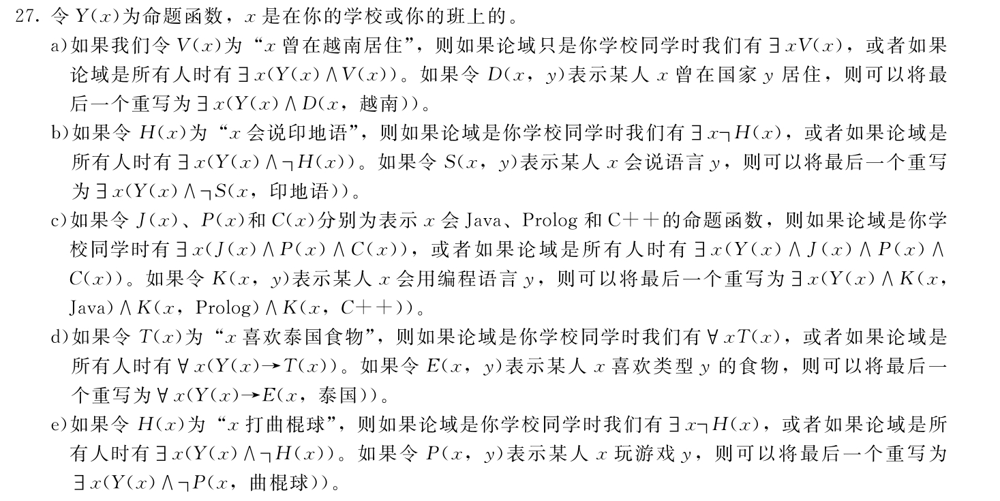
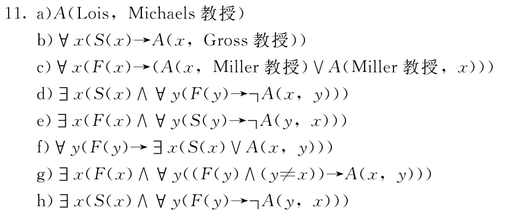

# 数理逻辑与图论作业参考答案

[TOC]

## The Foundations: Logic and Proofs

### Propositional Logic

#### 1.1.13 G

> Let p and q be the propositions
> p: It is below freezing.
> q: It is snowing.
> Write these propositions using p and q and logical connectives (including negations).
> a) It is below freezing and snowing.
> b) It is below freezing but not snowing.
> c) It is not below freezing and it is not snowing.
> d) It is either snowing or below freezing (or both).
> e) If it is below freezing, it is also snowing.
> f ) Either it is below freezing or it is snowing, but it is not snowing if it is below freezing.
> g) That it is below freezing is necessary and sufficient for it to be snowing.

- a) $p\and q$
- b) $p\and\neg q$
- c) $\neg p\and\neg q$
- d) $p\or q$
- e) $p\to q$
- f) $(p\or q)\and(p\to\neg q)$
- g) $q\leftrightarrow p$

#### 1.1.19 G

>Determine whether each of these conditional statements is true or false.
>a) If 1 + 1 = 2, then 2 + 2 = 5.
>b) If 1 + 1 = 3, then 2 + 2 = 4.
>c) If 1 + 1 = 3, then 2 + 2 = 5.
>d) If monkeys can fly, then 1 + 1 = 3.

- a) F
- b) T
- c) T
- d) T

#### 1.1.35 G

>Construct a truth table for each of these compound propositions.
>a) $(p ∨ q) → (p ⊕ q)$
>b) $(p ⊕ q) → (p ∧ q)$
>c) $(p ∨ q) ⊕ (p ∧ q)$
>d) $(p ↔ q) ⊕ (¬p ↔ q)$
>e) $(p ↔ q) ⊕ (¬p ↔ ¬r)$
>f ) $(p ⊕ q) → (p ⊕ ¬q)$

- a)

| $p$  | $q$  | $p\or q$ | $p\oplus q$ | $(p\or q)\to(p\oplus q)$ |
| :--: | :--: | :------: | :---------: | :----------------------: |
|  T   |  T   |    T     |      F      |            F             |
|  T   |  F   |    T     |      T      |            T             |
|  F   |  T   |    T     |      T      |            T             |
|  F   |  F   |    F     |      F      |            T             |

- b)

| $p$  | $q$  | $p\oplus q$ | $p\and q$ | $(p\oplus q)\to(p\and q)$ |
| :--: | :--: | :---------: | :-------: | :-----------------------: |
|  T   |  T   |      F      |     T     |             T             |
|  T   |  F   |      T      |     F     |             F             |
|  F   |  T   |      T      |     F     |             F             |
|  F   |  F   |      F      |     F     |             T             |

- c)

| $p$  | $q$  | $p\or q$ | $p\and q$ | $(p\or q)\oplus(p\and q)$ |
| :--: | :--: | :------: | :-------: | :-----------------------: |
|  T   |  T   |    T     |     T     |             F             |
|  T   |  F   |    T     |     F     |             T             |
|  F   |  T   |    T     |     F     |             T             |
|  F   |  F   |    F     |     F     |             F             |

- d)

| $p$  | $q$  | $\neg p$ | $p\leftrightarrow q$ | $\neg p\leftrightarrow q$ | $(p\leftrightarrow q)\oplus(\neg p\leftrightarrow q)$ |
| :--: | :--: | :------: | :------------------: | :-----------------------: | :---------------------------------------------------: |
|  T   |  T   |    F     |          F           |             F             |                           T                           |
|  T   |  F   |    F     |          T           |             T             |                           T                           |
|  F   |  T   |    T     |          T           |             T             |                           T                           |
|  F   |  F   |    T     |          F           |             F             |                           T                           |

- e)

| $p$  | $q$  | $r$  | $\neg p$ | $\neg r$ | $p\leftrightarrow q$ | $\neg p\leftrightarrow\neg r$ | $(p\leftrightarrow q)\oplus(\neg p\leftrightarrow\neg r)$ |
| :--: | :--: | :--: | :------: | :------: | :------------------: | :---------------------------: | :-------------------------------------------------------: |
|  T   |  T   |  T   |    F     |    F     |          T           |               T               |                             F                             |
|  T   |  T   |  F   |    F     |    T     |          T           |               F               |                             T                             |
|  T   |  F   |  T   |    F     |    F     |          F           |               T               |                             T                             |
|  T   |  F   |  F   |    F     |    T     |          F           |               F               |                             F                             |
|  F   |  T   |  T   |    T     |    F     |          F           |               F               |                             F                             |
|  F   |  T   |  F   |    T     |    T     |          F           |               T               |                             T                             |
|  F   |  F   |  T   |    T     |    F     |          T           |               F               |                             T                             |
|  F   |  F   |  F   |    T     |    T     |          T           |               T               |                             F                             |

- f)

| $p$  | $q$  | $\neg q$ | $p\oplus q$ | $p\oplus\neg q$ | $(p\oplus q)\to(p\oplus\neg q)$ |
| :--: | :--: | :------: | :---------: | :-------------: | :-----------------------------: |
|  T   |  T   |    F     |      F      |        T        |                T                |
|  T   |  F   |    T     |      T      |        F        |                F                |
|  F   |  T   |    F     |      T      |        F        |                F                |
|  F   |  F   |    T     |      F      |        T        |                T                |

#### 1.1.43 G

>Explain, without using a truth table, why $(p \or q \or r) \and (\neg p \or \neg q \or \neg r)$ is true when at least one of $p$, $q$, and ￥ is true and at least one is false, but is false when all three variables have the same truth value.

- 至少有一个为真时，析取式前半的合取式为真；至少有一个为假时，析取式后半的合取式为真；故析取式为真。
- 三个变量具有相同的真值时，析取式的前半与后半的合取式的真值相反，故析取式为假。

### Applications of Propositional Logic

#### 1.2.11 G

>Are these system specifications consistent? “The router can send packets to the edge system only if it supports the new address space. For the router to support the new address space it is necessary that the latest software release be installed. The router can send packets to the edge system if the latest software release is installed. The router does not support the new address space.”

令 $p$ 为“路由器能向边缘系统发送分组”， $q$ 为“路由器支持新的地址空间”，令 $r$ 为“路由器安装了最新版本的软件”。则上面几个规范说明可以写为：
$$
p\rightarrow q, q\to r, r\to p,\neg q.
$$
使规范说明都为真时， $\neg q$为真， $q$ 必为假。由 $p\rightarrow q$ ， $p$ 也为假。由 $r\to p$ 为真，得 $r$ 为假。此时 $q\to r$ 也为真，故这些规范说明是一致的。

#### 1.2.29 G

>Exercises 28–35 relate to inhabitants of an island on which there are three kinds of people: knights who always tell the truth, knaves who always lie, and spies (called normals by 39. Smullyan [Sm78]) who can either lie or tell the truth. You encounter three people, A, B, and C. You know one of these people is a knight, one is a knave, and one is a spy. Each of the three people knows the type of person each of other two is. For each of these situations, if possible, determine whether there is a unique solution and determine who the knave, knight, and spy are. When there is no unique solution, list all possible solutions or state that there are no solutions.
>
>A says “I am the knight,” B says “I am the knave,” and C says “B is the knight.”

设 $x_1,x_2,x_3,x_4,x_5,x_6$ 分别表示 $(A,B,C)$ 是 $(骑士,无赖,间谍)$，$(骑士,间谍,无赖)$，$(间谍,骑士,无赖)$，$(间谍,无赖,骑士)$，$(无赖,骑士,间谍)$，$(无赖,间谍,骑士)$。

则 $x_1\or x_2$ 表示"A 是骑士"，$x_1\or x_4$ 表示“B 是无赖”，$x_3\or x_5 $ 表示“B 是骑士”。

情况可以形式化地表述为：
$$
\begin{cases}
( x_1\and\neg x_2\and\neg x_3\and\neg x_4\and\neg x_5\and\neg x_6)\or(\neg x_1\and x_2\and\neg x_3\and\neg x_4\and\neg x_5\and\neg x_6)\or\\
(\neg x_1\and\neg x_2\and x_3\and\neg x_4\and\neg x_5\and\neg x_6)\or(\neg x_1\and\neg x_2\and\neg x_3\and x_4\and\neg x_5\and\neg x_6)\or\\
(\neg x_1\and\neg x_2\and\neg x_3\and\neg x_4\and x_5\and\neg x_6)\or(\neg x_1\and\neg x_2\and\neg x_3\and\neg x_4\and\neg x_5\and x_6)=1,\\
(x_1\and(x_1\or x_2)\and(\neg(x_1\or x_4)))\or(x_2\and(x_1\or x_2)\and(\neg(x_3\or x_5)))\or\\
(x_3\and(x_1\or x_4)\and(\neg(x_3\or x_5)))\or(x_4\and(x_3\or x_5)\and(\neg(x_1\or x_4)))\or\\
(x_5\and(x_1\or x_4)\and(\neg(x_1\or x_2)))\or(x_6\and(x_3\or x_5)\and(\neg(x_1\or x_2)))=1.
\end{cases}
$$
由第一式可知 $(x_1,\cdots,x_6)$ 的取值仅有 $(0,0,0,0,0,1)$、$(0,0,0,0,1,0)$、$(0,0,0,1,0,0)$、$(0,0,1,0,0,0)$、$(0,1,0,0,0,0)$、$(1,0,0,0,0,0)$ 六种。

分别带入第二式，得到仅有 $(0,1,0,0,0,0)$ 时成立，即该问题有唯一解：A 是骑士，B 是间谍，C 是无赖。

#### 1.2.39 C

>A detective has interviewed four witnesses to a crime. From the stories of the witnesses the detective has concluded that if the butler is telling the truth then so is the cook; the cook and the gardener cannot both be telling the truth; the gardener and the handyman are not both lying; and if the handyman is telling the truth then the cook is lying. For each of the four witnesses, can the detective determine whether that person is telling the truth or lying? Explain your reasoning.

记男管家、厨师、园丁、杂役说真话为$p,q,r,s$，已知的真命题有$p \to q$,$\neg(q\and r)$,$\neg(\neg r\and\neg s)$,$s\to\neg q$.这里发现$q,r,s$互相在一个命题中产生联系，先假设$q$为真，易于推出矛盾，而$q$为假不产生矛盾，因此$q$为假。由$p\to q$可知$p$也为假。这时分别假设$r,s$为真或假都不会产生矛盾，因此不能确定其真值。

所以男管家、厨师在说假话，园丁、杂役不能确定。

### Propositional Equivalences

#### 1.3.19 C

>Determine whether $(¬q ∧ (p → q)) → ¬p$ is a tautology.

使用真值表当然可行。使用逻辑恒等式，例如：

$(¬q ∧ (p → q)) → ¬p \equiv \neg(\neg q\and(p\to q))\or\neg p$

$\equiv q\or(\neg(p\to q))\or\neg p$

$\equiv (p\and\neg q)\or\neg p\or q$

$\equiv(p\and\neg q)\or(\neg(p\and\neg q))$

$\equiv T$

所以它是永真式。

#### 1.3.29 C

>Show that $(p → r) ∨ (q → r)$ and $(p ∧ q) → r$ are logically equivalent.

使用真值表当然可行。使用逻辑恒等式，例如：

$(p\to r)\or(q\to r)\equiv \neg p\or r\or\neg q\or r$

$\equiv (\neg p\or\neg q)\or r$

$\equiv \neg(p\and q)\or r$

$\equiv (p\and q)\to r$

#### 1.3.33 C

> Show that $(p → q) ∧ (q → r) → (p → r)$ is a tautology.

使用真值表当然可行。使用逻辑恒等式，例如：

$(p\to q)\and(q\to r)\to(p\to r)\equiv\neg(\neg(\neg p\or q)\or\neg(\neg q\or r))\to(\neg p\or r)$

$\equiv(\neg(\neg p\or q))\or(\neg(\neg q\or r))\or(\neg p\or r)$

$\equiv \neg p\or(p\and\neg q)\or r\or(q\and\neg r)$

$\equiv((\neg p\or p)\and(\neg p\or\neg q))\or((r\or\neg r)\and(q\or\neg r))$

$\equiv\neg p\or \neg q\or q\or\neg r$

$\equiv T$ 

#### 1.3.45 C

>Find a compound proposition involving the propositional variables $p$, $q$, and $r$ that is true when exactly two of $p$, $q$, and $r$ are true and is false otherwise. 

依据字面意思即可写出：

$propositional(p\and q\and\neg r)\or(p\and\neg q\and r)\or(\neg p\and q\and r)$

#### 1.3.55 C

>Find a compound proposition logically equivalent to $p → q$ using only the logical operator $↓$.

$p\to q\equiv\neg p\or q$

$\equiv\neg(p\and\neg q)$

$\equiv\neg(\neg\neg p\and\neg q)$

$\equiv\neg(\neg p\downarrow q)$

$\equiv\neg((p\downarrow p)\downarrow q)$

$\equiv((p\downarrow p)\downarrow q)\downarrow((p\downarrow p)\downarrow q)$

### Predicates and Quantifiers

#### 1.4.7 C

>Translate these statements into English, where $C(x)$ is “$x$ is a comedian” and $F(x)$ is “$x$ is funny” and the domain consists of all people.
>a) $∀x(C(x) → F(x))$
>b) $∀x(C(x) ∧ F(x))$
>c) $∃x(C(x) → F(x))$
>d) $∃x(C(x) ∧ F(x))$

a)每个喜剧演员都很有趣；

b)每个人都是很有趣的喜剧演员；

c)存在某个人，如果他是喜剧演员，那么他是很有趣的；

d)某些喜剧演员是很有趣的。

#### 1.4.27 C

>Translate each of these statements into logical expressions in three different ways by varying the domain and by using predicates with one and with two variables.
>a) A student in your school has lived in Vietnam.
>b) There is a student in your school who cannot speak Hindi.
>c) A student in your school knows Java, Prolog, and C++.
>d) Everyone in your class enjoys Thai food.
>e) Someone in your class does not play hockey.

#### 1.4.63 C

>Let $P(x)$, $Q(x)$, $R(x)$, and $S(x)$ be the statements “$x$ is a baby,” “$x$ is logical,” “$x$ is able to manage a crocodile,” and “$x$ is despised,” respectively. Suppose that the domain consists of all people. Express each of these statements using quantifiers; logical connectives; and $P(x)$, $Q(x)$, $R(x)$, and $S(x)$.
>a) Babies are illogical.
>b) Nobody is despised who can manage a crocodile.
>c) Illogical persons are despised.
>d) Babies cannot manage crocodiles.
>e) Does (d) follow from (a), (b), and (c)? If not, is there a correct conclusion?

a)$\forall x(P(x)\to\neg Q(x))$

b)$\forall x(R(x)\to\neg S(x))$

c)$\forall x(\neg Q(x)\to S(x))$

d)$\forall x(P(x)\to\neg R(x))$

e)可以得出结论。把b)变为$\forall x(S(x)\to \neg R(x))$，反复利用$(p\to q)\and(q\to r)\to(p\to r)$即可由a、b、c得到d。

### Nested Quantifiers

#### 1.5.7 C

>Let $T(x, y)$ mean that student $x$ likes cuisine $y$, where the domain for $x$ consists of all students at your school andt he domain for $y$ consists of all cuisines. Express each of these statements by a simple English sentence.
>a) $¬T(Abdallah Hussein, Japanese)$
>b) $∃xT(x, Korean) ∧ ∀xT(x, Mexican)$
>c) $∃y(T(Monique Arsenault, y) ∨T(Jay Johnson, y))$
>d) $∀x∀z∃y((x ≠ z) → ¬(T(x, y) ∧ T(z, y)))$
>e) $∃x∃z∀y(T(x, y) ↔ T(z, y))$
>f ) $∀x∀z∃y(T(x, y) ↔ T(z, y))$

#### 1.5.11 C

>Let $S(x)$ be the predicate “$x$ is a student,” $F(x)$ the predicate “$x$ is a faculty member,” and $A(x, y)$ the predicate“$x$ has asked $y$ a question,” where the domain consists of all people associated with your school. Use quantifiers to express each of these statements.
>a) Lois has asked Professor Michaels a question.
>b) Every student has asked Professor Gross a question.
>c) Every faculty member has either asked Professor Miller a question or been asked a question by Professor Miller.
>d) Some student has not asked any faculty member a question.
>e) There is a faculty member who has never been asked a question by a student.
>f ) Some student has asked every faculty member a question.
>g) There is a faculty member who has asked every other faculty member a question.
>h) Some student has never been asked a question by a faculty member.

#### 1.5.21 C

>Use predicates, quantifiers, logical connectives, and mathematical operators to express the statement that every positive integer is the sum of the squares of four integers.

#### 1.5.35 C

>Find a common domain for the variables $x$, $y$, $z$, and $w$ for which the statement $∀x∀y∀z∃w((w ≠ x) ∧ (w ≠ y) ∧ (w ≠ z))$ is true and another common domain for these variables for which it is false.

### Rules of Inference

#### 1.6.11 G

>Showthattheargumentformwithpremisesp 1 ,p 2 ,…,p n and conclusion q → r is valid if the argument form with premises p 1 ,p 2 ,…,p n ,q, and conclusion r is valid.

#### 1.6.23 G

> Identify the error or errors in this argument that sup-posedly shows that if ∃xP(x) ∧ ∃xQ(x) is true then ∃x(P(x) ∧ Q(x)) is true.
> 
> 1.∃xP(x) ∨ ∃xQ(x) Premise
>2.∃xP(x) Simplification from (1)
> 3.P(c) Existential instantiation from (2)
> 4.∃xQ(x) Simplification from (1)
> 5.Q(c) Existential instantiation from (4)
> 6.P(c) ∧ Q(c) Conjunction from (3) and (5)
> 7.∃x(P(x) ∧ Q(x)) Existential generalization

#### 1.6.29 G

>Use rules of inference to show that if ∀x(P(x) ∨ Q(x)),∀x(¬Q(x) ∨ S(x)), ∀x(R(x) → ¬S(x)), and ∃x¬P(x) are true, then ∃x¬R(x) is true.

#### 1.6.35 G

>Determine whether this argument, taken from Kalish and Montague [KaMo64], is valid.
>If Superman were able and willing to prevent evil, he would do so. If Superman were unable to prevent evil,he would be impotent; if he were unwilling to prevent evil, he would be malevolent. Superman does not prevent evil. If Superman exists, he is neither impotent nor malevolent. Therefore, Superman does not exist.

#### 

### Introduction to Proofs

#### 1.7.15 G

> Prove that if x is an irrational number and x > 0, then √ x is also irrational.

#### 1.7.19 G

> Show that if n is an integer and n 3 + 5 is odd, then n is even using
> a) a proof by contraposition.
> b) a proof by contradiction.

#### 1.7.41 G

> Prove that at least one of the real numbers a 1 , a 2 ,…,a n is greater than or equal to the average of these numbers. What kind of proof did you use?

### Proof Methods and Strategy

## Basic Structures: Sets, Functions, Sequences, Sums, and Matrices

## Counting

## Advanced Counting Techniques

## Relations

## Graphs
