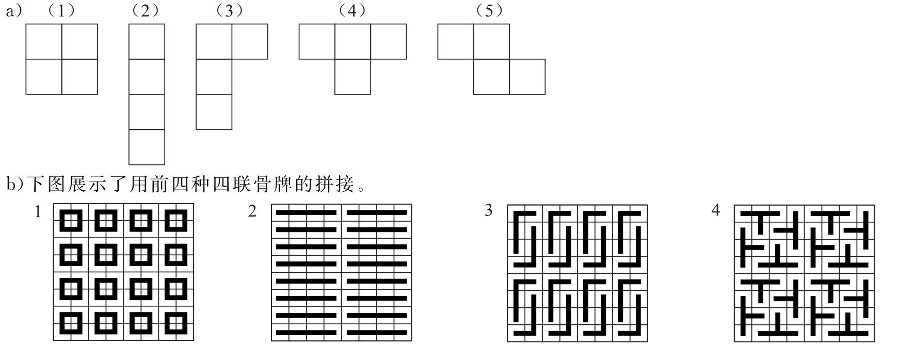

>  Mathematical Logic and Graph Theory 2022 Homework 03 Answers
>
> By [Jingyi Chen](chenjingyi071@mail.ustc.edu.cn) with C and [Songxiao Guo](logname@mail.ustc.edu.cn) with G after each question number.

[TOC]
#### 1.8.5 C

>Prove that if $x$ and $y$ are real numbers, then $\max(x, y) + \min(x, y) = x + y$.

假设$x\geq y$，则$\max(x,y)=x,\min(x,y)=y$；假设$x\leq y$，则$\max(x,y)=y,\min(x,y)=x$，$\therefore x+y=\max(x,y)+\min(x,y)$。

#### 1.8.13 C

>Prove that there exists a pair of consecutive integers such that one of these integers is a perfect square and the other is a perfect cube.

8和9。

#### 1.8.27 G

>Write the numbers $1, 2, \cdots , 2n$ on a blackboard, where n is an odd integer. Pick any two of the numbers, $j$ and 
>$k$, write $|j − k|$ on the board and erase $j$ and $k$. Continue this process until only one integer is written on the board. Prove that this integer must be odd.

数字和的奇偶性不变。最初情况为$1+2+\cdots+2n=n(2n+1)\equiv n\equiv 1(\mod 2)$。每次减少一个数，最后达到只剩一个数的情况，此时该数为奇数。

#### 1.8.51 G

>- a) Draw each of the five different tetrominoes, where a tetromino is a polyomino consisting of four squares.
>- b) For each of the five different tetrominoes, prove or disprove that you can tile a standard checkerboard using these tetrominoes.

假设第(5)种可以覆盖，则左上角必定有一块。根据其形状，则第一行或第一列的每个位置都有唯一的放置方式，将导致第一行或第一列最后一个格子无法被覆盖。

#### 2.1.11 G

>Determine whether each of these statements is true or false.
>
>- a) $0 ∈ ∅$
>- b) $∅ ∈ \{0\}$
>- c) $\{0\} ⊂ ∅$
>- d) $ ∅ ⊂ \{0\}$
>- e) $\{0\} ∈ \{0\}$
>- f ) $\{0\} ⊂ \{0\}$
>- g) $\{∅\} ⊆ \{∅\}$

- a) F
- b) F
- c) F
- d) T
- e) F
- f) F
- g) T

#### 2.1.27 G

> Prove that $\mathcal P(A) ⊆ \mathcal P(B)$ if and only if $A ⊆ B$.

- 充分性：已知 $A\subseteq B$，对 $\forall x\in\mathcal P(A)$，有 $x\subseteq A\subseteq B$，故有 $x\in \mathcal P(B)$。由 $x$ 的任意性得 $\mathcal P(A)\subseteq \mathcal P(B)$.
- 必要性：已知 $\mathcal P(A)\subseteq\mathcal P(B)$，对 $\forall x\in A$，有 $\{x\}\in\mathcal P(A)\subseteq\mathcal P(B)$，故有 $x\in B$。由 $x$ 的任意性得 $A\subseteq B$.

#### 2.1.41 G

> Explain why $A × B × C$ and $(A × B) × C$ are not the same.

$$
A\times B\times C=\{(a,b,c)|a\in A,b\in B,c\in C\},\\
(A\times B)\times C=\{((a,b),c)|a\in A,b\in B,c\in C\}.
$$

#### 2.1.43 G

>Prove or disprove that if $A$ and $B$ are sets, then $\mathcal P(A × B) =\mathcal P(A) × \mathcal P(B)$.

结论错误。设 $A=B=\empty$，则 $\mathcal P(A\times B)=\{\empty\}$，$\mathcal P(A)\times\mathcal P(B)=\{(\empty,\empty)\}$，二者明显不相等。

#### 2.1.49 G

>The defining property of an ordered pair is that two ordered pairs are equal if and only if their first elements are
>equal and their second elements are equal. Surprisingly, instead of taking the ordered pair as a primitive concept, we can construct ordered pairs using basic notions from set theory. Show that if we define the ordered pair $(a, b)$ to be $\{\{a\}, \{a, b\}\}$, then $(a, b) = (c, d)$ if and only if $a = c$ and $b = d$. 

- 充分性：已知 $a=c,b=d$ 时，$\{\{a\},\{a,b\}\}=\{\{c\},\{c,d\}\}$ 显然成立。
- 必要性：已知 $\{\{a\},\{a,b\}\}=\{\{c\},\{c,d\}\}$ 时，
  - $a=b$，则 $\{\{a\},\{a,b\}\}=\{a\}$，$\{\{c\},\{c,d\}\}=\{c\}$，即已知 $\{a\}=\{c\}$，便有 $a=c$，推知 $b=d$。
    - $a\neq b$，则 $\{\{a\},\{a,b\}\}$ 是二元集，含有一个一元集和一个二元集。两集合相等，故 $\{\{c\},\{c,d\}\}$ 也含有一个一元集和一个二元集。这样便有 $c\ne d$。故 $\{a\}=\{c\}\Rightarrow a=c$。又$\{a,b\}=\{c,d\}$，易得 $b=d$。

#### 2.2.19 G

>Show that if $A$, $B$, and $C$ are sets, then $\overline{A ∩ B ∩ C} = \overline A ∪\overline B ∪ \overline C$
>
>- a) by showing each side is a subset of the other side.
>- b) using a membership table.

- a) 
  $$
  \begin{align}
  x\in \overline{A ∩ B ∩ C} &\equiv x\in \overline A ∪\overline B ∪ \overline C\\
  &\equiv x\notin A\or x\notin B\or x\notin C\\
  &\equiv x\in \overline A\or x\in\overline B\or x\in\overline C\\
  &\equiv x\in \overline A ∪\overline B ∪ \overline C.
  \end{align}
  $$

- 

| $A$  | $B$  | $C$  | $A\cap B\cap C$ | $\overline {A\cap B\cap C}$ | $\overline A$ | $\overline B$ | $\overline C$ | $\overline A ∪\overline B ∪ \overline C$ |
| :--: | :--: | :--: | :-------------: | :-------------------------: | :-----------: | :-----------: | :-----------: | :--------------------------------------: |
|  1   |  1   |  1   |        1        |              0              |       0       |       0       |       0       |                    0                     |
|  1   |  1   |  0   |        0        |              1              |       0       |       0       |       1       |                    1                     |
|  1   |  0   |  1   |        0        |              1              |       0       |       1       |       0       |                    1                     |
|  1   |  0   |  0   |        0        |              1              |       0       |       1       |       1       |                    1                     |
|  0   |  1   |  1   |        0        |              1              |       1       |       0       |       0       |                    1                     |
|  0   |  1   |  0   |        0        |              1              |       1       |       0       |       1       |                    1                     |
|  0   |  0   |  1   |        0        |              1              |       1       |       1       |       0       |                    1                     |
|  0   |  0   |  0   |        0        |              1              |       1       |       1       |       1       |                    1                     |

#### 2.2.35 G

>Let $A$, $B$, and $C$ be sets. Use the identities in Table 1 to show that $\overline{(A ∪ B)} ∩\overline{ (B ∪ C)} ∩\overline{ (A ∪ C)} = \overline A ∩ \overline B ∩\overline C$.

$$
\begin{align}
\overline{(A ∪ B)} ∩\overline{ (B ∪ C)} ∩\overline{ (A ∪ C)} 
&=\overline A\cap\overline B\cap\overline B\cap\overline C\cap\overline A\cap\overline C& 德\cdot 摩根律\\
&=\overline A\cap(\overline B\cap\overline B)\cap\overline C\cap\overline A\cap\overline C&结合律\\
&=\overline A\cap\overline B\cap\overline C\cap\overline A\cap\overline C&幂等律\\
&=\overline A\cap\overline B\cap(\overline C\cap\overline A)\cap\overline C&结合律\\
&=\overline A\cap\overline B\cap(\overline A\cap\overline C)\cap\overline C&交换律\\
&=\overline A\cap\overline B\cap\overline A\cap(\overline C\cap\overline C)&结合律\\
&=\overline A\cap\overline B\cap\overline A\cap\overline C&幂等律\\
&=\overline B\cap\overline A\cap\overline A\cap\overline C&交换律\\
&=\overline B\cap(\overline A\cap\overline A)\cap\overline C&结合律\\
&=\overline B\cap\overline A\cap\overline C&幂等律\\
&=\overline A\cap\overline B\cap\overline C&交换律.
\end{align}
$$

#### 2.2.47 C
>Suppose that $A$, $B$, and $C$ are sets such that $A ⊕ C =B ⊕ C$. Must it be the case that $A = B$?

是的。

对$\forall x\in A$，如果$x\in C$则有$x\notin A\oplus C$，因此$x\notin B\oplus C$，从而$x\in B$；

如果$x\notin C$则有$x\in A\oplus C$，因此$x\in B\oplus C$，从而$x\in B$；

对$\forall x\in B$，同理有$x\in A$，所以$A=B$。

#### 2.3.3 C

>Determine whether $f$ is a function from the set of all bit strings to the set of integers if
>
>- a) $f (S)$ is the position of a $0$ bit in $S$.
>- b) $f (S)$ is the number of $1$ bits in $S$.
>- c) $f (S)$ is the smallest integer $i$ such that the $i$th bit of $S$ is $1$ and $f (S) = 0$ when $S$ is the empty string, the string with no bits.

a) 不是，因为“某个0”的位置是不确定的。

b)是的，1的个数由$S$确定。

c)不是，例如$S$是000。

#### 2.3.21 C

>Give an explicit formula for a function from the set of integers to the set of positive integers that is
>
>- a) one-to-one, but not onto.
>- b) onto, but not one-to-one.
>- c) one-to-one and onto.
>- d) neither one-to-one nor onto.

- a)例如$f(x)=3x+1(x\geq 0),f(x)=-3x+2(x<0)$。
- b)例如$f(x)=|x|+1$。
- c)例如$f(x)=2x+1(x\geq 0),f(x)=-2x(x<0)$。
- d)例如$f(x)=x^2+1$。

#### 2.3.37 C    

>If $f$ and $f ◦g$ are onto, does it follow that $g$ is onto? Justify your answer.

不一定，比如$A={a},B={b,c},C={d},g(a)=b,f(b)=d,f(c)=d$。类似这样构造一个中间的较大的集合和两侧较小的集合，使得g不能映上即可。 

#### 2.4.27 C

>Show that if $a_n$ denotes the $n$th positive integer that is not a perfect square, then $a_n = n + \{\sqrt n\}$, where $\{x\}$ denotes the integer closest to the real number $x$.

把正整数分成两部分，一部分是完全平方数$1^2,2^2,...,k^2$，另一部分是去掉完全平方数后的序列$a_1,a_2,...,a_n$，这时$k^2<n+k<(k+1)^2$，

即$(k-1/2)^2+3/4=k^2-k+1\leq n\leq(k+1/2)^2-1/4$，

因此$k=\left\{\sqrt n\right\}$，$a_n=n+\left\{\sqrt n\right\}$。

#### 2.5.11 C

>Give an example of two uncountable sets $A$ and $B$ such that $A ∩ B$ is
>
>- a) finite.
>- b) countably infinite.
>- c) uncountable.

- a)例如$A=[0,1], B=[2,3],$ 直接没交集。
- b)例如$A=[0,1]\cup Z,B=[2,3]\cup Z$，交集把不可数的去掉了。
- c)例如$A=B=[0,1]$，交集有一段不可数的即可。

#### 2.5.17 C

>If $A$ is an uncountable set and $B$ is a countable set, must $A − B$ be uncountable?

是的。如果$A-B$可数，则$(A-B)+(A\cap B)=A$可数；$A$不可数，所以$A-B$不可数。

#### 2.5.31 G

>Show that $Z^ + × Z^ +$ is countable by showing that the polynomial function $f : Z^ + × Z^ + → Z ^+$ with $f (m, n) =
>(m + n − 2)(m + n − 1)∕2 + m$ is one-to-one and onto.

- 映上：对于任意$z=f(m,n)$，若$(x-2)(x-1)/2<z<(x-1)x/2$，则取$m=z-(x-2)(x-1)/2,n=x-m$。

- 一对一：先证明 $m+n$ 固定时函数是一对一的。$f(x)=(x-2)(x-1)/2$，在$(1,\infty)$ 上单调递增，故为一对一的。
  
   假设$f(m_1,n_1)=f(m_2,n_2)$，则
  $$
  0=f(m_1,n_1)-f(m_2,n_2)=\\m_1-m_2+\frac12((m_1+m_2)(m_1-m_2)+(n_1+n_2)(n_1-n_2)+2n_1m_1-2n_2m_2-3(m_1-m_2)-3(n_1-n_2))\\=(m_1-m_2)(\frac12(m_1+m_2)+n_1-1)+(n_1-n_2)(\frac12(n_1+n_2)+m_1-\frac32).
  $$
  若 $m_1=m_2$ ，则 $n_1=n_2$；否则 $(n_1-n_2)\neq0$，等价地可推出
  $$
  0=(m_2-m_1)(\frac12(m_2+m_1)+n_2-1)+(n_2-n_1)(\frac12(n_2+n_1)+m_2-\frac32)，
  $$
  由 $(\frac12(m_1+m_2)+n_1-1)>0$，$(\frac12(n_1+n_2)+m_1-\frac32)>0$，无论 $n_1>n_2$ 还是 $n_2>n_1$ ，都有正数等于 $0$ 的矛盾。故有$m_1=m_2,n_1=n_2$。