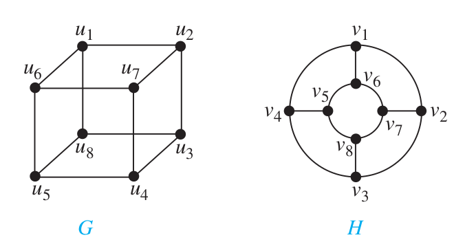

>Mathematical Logic and Graph Theory 2022 Homework 8 Answers
>
>By [Jingyi Chen](chenjingyi071@mail.ustc.edu.cn) with C and [Songxiao Guo](logname@mail.ustc.edu.cn) with G after each question number.

[TOC]

#### 6.4.15

>Find the strongly connected components of each of these graphs.
>
>

#### 6.4.23

>Use paths either to show that these graphs are not isomorphic or to find an isomorphism between them.
>
>

#### 6.4.37

>Show that a simple graph with at least two vertices has at least two vertices that are not cut vertices.

#### 6.4.45

>Show that a simple graph $G$ with $n$ vertices is connected if it has more than $(n − 1)(n − 2)∕2$ edges.

#### 6.4.47

>How many nonisomorphic connected simple graphs are there with n vertices when n is
>a) 2?
>b) 3?
>c) 4?
>d) 5?

#### 6.4.53

>Find $𝜅(K_{ m,n} )$ and $𝜆(K_{ m,n} )$, where m and n are positive integers.

#### 6.5.9

>Suppose that in addition to the seven bridges of Königsberg (shown in Figure 1) there were two additional bridges, connecting regions $B$ and $C$ and regions $B$ and $D$, respectively. Could someone cross all nine of these bridges exactly once and return to the starting point?
>
>

#### 6.5.23

>Determine whether the directed graph shown has an Euler circuit. Construct an Euler circuit if one exists. If no Euler circuit exists, determine whether the di rected graph has an Euler path. Construct an Euler path if one exists.
>
>

#### 6.5.45

>For which values of $m$ and $n$ does the complete bipartite graph $K_{m,n}$ have a Hamilton circuit?

#### 6.5.47

>For each of these graphs, determine (i ) whether Dirac’s theorem can be used to show that the graph has a Hamilton circuit, (ii) whether Ore’s theorem can be used to show that the graph has a Hamilton circuit, and (iii )
>whether the graph has a Hamilton circuit.
>
>

#### 6.5.63

>Show that there is no reentrant knight’s tour on an $m × n$ chessboard when $m$ and $n$ are both odd.