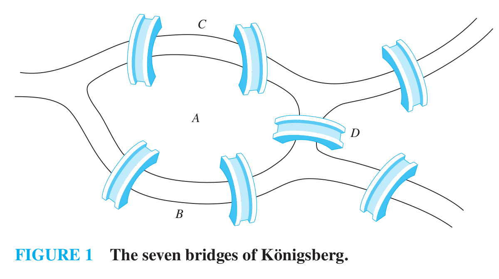
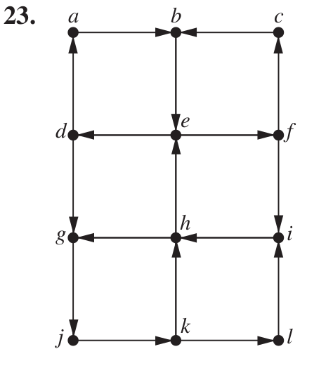
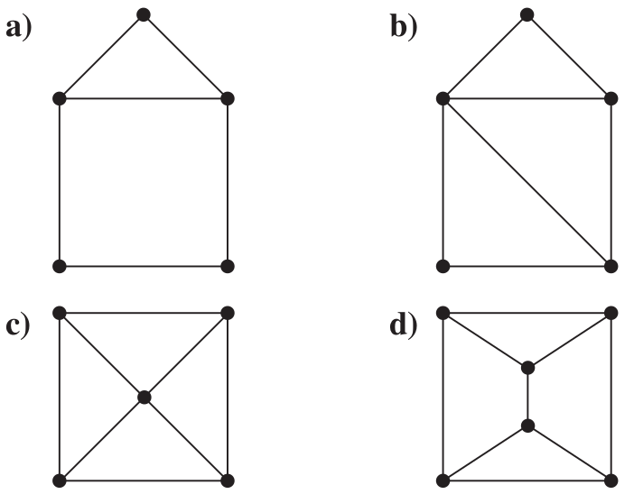
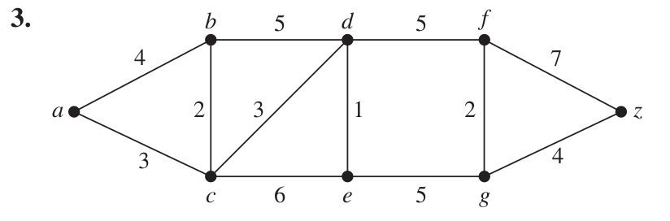
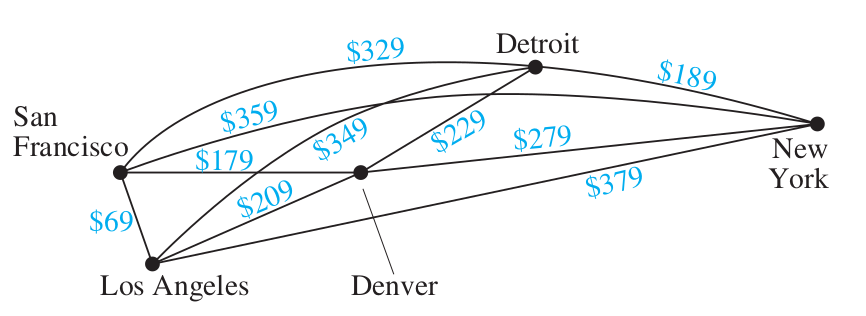

>Mathematical Logic and Graph Theory 2022 Homework 09 Answers
>
>By [Jingyi Chen](chenjingyi071@mail.ustc.edu.cn) with C and [Songxiao Guo](logname@mail.ustc.edu.cn) with G after each question number.

[TOC]

#### 6.5.9 G

>Suppose that in addition to the seven bridges of Königsberg (shown in Figure 1) there were two additional bridges, connecting regions $B$ and $C$ and regions $B$ and $D$, respectively. Could someone cross all nine of these bridges exactly once and return to the starting point?
>
>

不能。$A$ 仍然为奇数度，故没有 Euler 回路。

#### 6.5.23 G

>Determine whether the directed graph shown has an Euler circuit. Construct an Euler circuit if one exists. If no Euler circuit exists, determine whether the directed graph has an Euler path. Construct an Euler path if one exists.
>
>

不具有 Euler 通路：$b,d,f$ 的入度不等于出度。故也没有 Euler 回路。

#### 6.5.45 G

>For which values of $m$ and $n$ does the complete bipartite graph $K_{m,n}$ have a Hamilton circuit?

首先说明 $m=n>2$ 时结论成立：设 $V(K_{m,n})=V(G)\cup V(H),V(G)\cap V(H)=\empty,V(G)=V(H)=n.$ 记 $V(G)=\{x_1,x_2,\cdots x_n\},V(H)=\{y_1,y_2,\cdots y_n\}.$ 那么 $x_1,y_1,\cdots x_k,y_k,x_{k+1},\cdots,y_n,x_1$ 就是一个 Hamilton 回路。

再说明其他情况不成立。$m\neq n$ 时，若存在 Hamilton 回路，则必存在 Hamilton 通路；设 Hamilton 通路为 $u_1,u_2,\cdots u_n$，不妨设 $u_1\in V(G)$，则归纳可证 $u_{2k}\in V(H),u_{2k+1}\in V(G),0<2k\leq n.$ 这样得到 $V(H)=V(G).$ 而 $m=n=1$ 时，显然不存在 Hamilton 回路。

#### 6.5.47 G

>For each of these graphs, determine 
>
>(i) whether Dirac’s theorem can be used to show that the graph has a Hamilton circuit, 
>
>(ii) whether Ore’s theorem can be used to show that the graph has a Hamilton circuit, and 
>
>(iii) whether the graph has a Hamilton circuit.
>
>

- a) 
  - $\nu(G)=5,\delta(G)=2,\delta(G)<\nu(G)/2$，不能用 Dirac 定理；
  - $\exist u,v\in V(G),\deg(u)+\deg(v)=4<\nu(G)-1$，不能用 Ore 定理；
  - 显然存在 Hamilton 回路。
- b)
  - $\nu(G)=5,\delta(G)=2,\delta(G)<\nu(G)/2$，不能用 Dirac 定理；
  - $\exist u,v\in V(G),\deg(u)+\deg(v)=4<\nu(G)-1$，不能用 Ore 定理；
  - 显然存在 Hamilton 回路。
- c)
  - $\nu(G)=5,\delta(G)=3,\delta(G)>\nu(G)/2$，能用 Dirac 定理；
  - $\forall u,v\in V(G),\deg(u)+\deg(v)\leq7>\nu(G)-1$，能用 Ore 定理；
  - 由 Dirac 定理或 Ore 定理存在 Hamilton 回路。
- d)
  - $\nu(G)=6,\delta(G)=3,\delta(G)\geq\nu(G)/2$，能用 Dirac 定理；
  - $\forall u,v\in V(G),\deg(u)+\deg(v)\leq6>\nu(G)-1$，能用 Ore 定理；
  - 由 Dirac 定理或 Ore 定理存在 Hamilton 回路。

#### 6.5.67 C

>Show that this graph does not have a Hamilton circuit.

（全情况分析）如果$aj\notin H$，则ab、ai、jk、jl在H中，所以$kl\notin H$，所以gk、dl、在H中；此时若ch不在H中则bc、cd、gh、hi在H中，形成没有顶点e、f的回路，不行，所以ch在H中。若bc和cd都在H中，或者gh和hi都在H中，则可以形成一条回路，由对称性，假设cd和hi都在H中，且其他两条边不在H中，则bf和fg在H中，产生的回路不包含顶点e。因此aj在H中。

利用以上思路，由对称性证明dl和gk在H中。这样的话，考虑j、k、l三个点，作为一个整体，它们与外圈有三条边相连且三条边都需要经过，这使得它们无论作为起点、终点还是中间路过的点都无法形成回路。

#### 6.6.3 C

>find the length of a shortest path between $a$ and $z$ in the given weighted graph.
>
>

16。a-c-d-e-g-z。

#### 6.6.27 C

>Find a route with the least total airfare that visits each of the cities in this graph, where the weight on an edge is the least price available for a flight between the two cities.
>
>

回路是旧金山-丹弗-底特律-纽约-洛杉矶-旧金山。

#### 6.6.31 C

>The longest path problem in a weighted directed graph with no simple circuits asks for a path in this graph such
>that the sum of its edge weights is a maximum. Devise an algorithm for solving the longest path problem.

先构建点的拓扑排序$v_1,v_2,...,v_n$，记边权值为$w(i,j)$，记$P(i)$表示终点为$i$的最长路径的权值，迭代$P(i)=max(P(j)+w(j,i))(j<i)$，找不到$j$时$P(i)=0$；这样所有点作为终点的$P(i)$都算出来了，选最大的即可。
