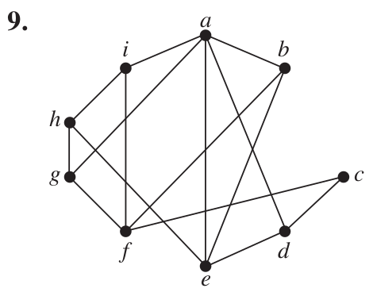
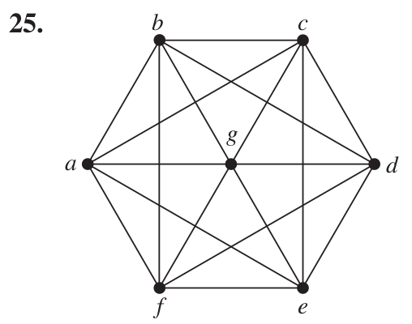
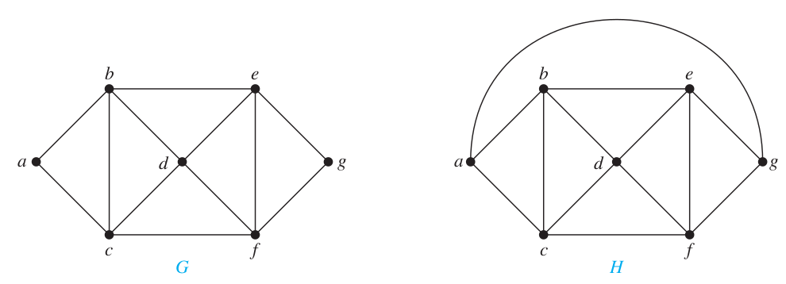

>Mathematical Logic and Graph Theory 2022 Homework 10 Answers
>
>By [Jingyi Chen](chenjingyi071@mail.ustc.edu.cn) with C and [Songxiao Guo](logname@mail.ustc.edu.cn) with G after each question number.

[TOC]

#### 6.7.9 G

>Determine whether the given graph is planar. If so, draw it so that no edges cross.
>
>

不是可平面图。考虑顶点导出子图 $G’=G[\{a,e,f,b,c,d,g,h\}]$，$G'$ 中 $h$ 和 $c$ 的度数是 $2$，采用同胚变换将其去掉并将该顶点关联的两条边连成一条边，得到一个 $K_{3,3}$。由 Kuratowsky 定理，存在与 $K_{3,3}$ 同胚的子图的图不是可平面图。

#### 6.7.17 G

>Suppose that a connected planar simple graph with $e$ edges and $v$ vertices contains no simple circuits of length $4$ or less. Show that $e ≤ (5∕3)v − (10∕3)$ if $v ≥ 4$.

由于该图不含长度小于等于 $4$ 的权，故设平面图的任意平面嵌入都不含边数小于等于 $4$ 的面。利用算两次的方法计算边$-$面对：$1$ 条边对应 $2$ 个边$-$面对；$1$ 个面对应大于等于 $5$ 个边$-$面对，故有 $2\varepsilon\geq5\phi$。带入 Euler 公式 $\nu-\varepsilon+\phi=2$ 并消去 $\phi$ 得 $\varepsilon\leq(5/3)\nu-(10/3)$。这里面用到 $v\geq4$，否则没有面。

6.7.25 G

>Use Kuratowski’s theorem to determine whether the given graph is planar.
>
>

不是可平面图。考虑顶点导出子图 $G’=G[\{a,c,f,b,e,g\}]$，是 $K_{3,3}$。由 Kuratowsky 定理，存在与 $K_{3,3}$ 同胚的子图的图不是可平面图。

#### 6.7.29 G

>Show that if $m$ and $n$ are even positive integers, the crossing number of $K_{ m,n}$ is less than or equal to $mn(m − 2)(n − 2)∕16$.

给出一个构造：在 x 轴上原点右边的顶点是 $(1,0),(2,0),\dots,(m/2,0)$；在 y 轴上原点右边的顶点是 $(1,0),(2,0),\dots,(n/2,0)$；在 y 轴上原点左边的顶点是 $(-1,0),(-2,0),\dots,(-m/2,0)$；在 y 轴上原点左边的顶点是 $(-1,0),(-2,0),\dots,(-n/2,0)$。

总交叉数是第一象限中的 $4$ 倍。对 $\forall a,b, 1\leq a<b\leq m/2$、$\forall r,s, 1\leq r<s\leq n/2$，产生一个交叉，故第一象限的交叉数为 ${{m/2}\choose 2}{ {n/2}\choose 2}$，总交叉数为$4{{m/2}\choose 2}{ {n/2}\choose 2}=mn(m − 2)(n − 2)∕16$。

#### 6.8.15 G

> What is the chromatic number of $W_ n,n\geq3$ ?

先证明 $W_3$ 的顶点色数是 $4$ 与 $W_4$ 的顶点色数为 $3$：如果用 $3$ 种颜色给 $V(W_3)$ 染色，则必有邻顶同色；如果用 $2$ 种颜色给 $V(W_4)$ 染色，则必有邻顶同色。

再证明 $\chi(W_n)=\chi(W_{n-2})$：取 $u,v\in V(W_n),(u,v)\in E(W_n)$，去掉 $u,v$ 以及与其相关联的边，再将 $u$ 的邻顶与 $v$ 的邻顶相连，得到 $W_{n-2}$。对 $V(W_{n-2})$ 染色，再将 $v$ 染为 $u$ 的邻顶的颜色，将 $u$ 染为 $v$ 的邻顶的颜色，得到 $V(W_n)$ 的一种染色，有 $\chi(W_n)=\chi(W_{n-2})$。

用归纳法即证 $\chi(W_n)=4,when\ n\ is\ odd;\ 3,when\ n\ is\ even$。

#### 6.8.19 G

>The mathematics department has six committees, each meeting once a month. How many different meeting
>times must be used to ensure that no member is scheduled to attend two meetings at the same time if the committees are $C_ 1 = \{Arlinghaus, Brand, Zaslavsky\}$, $C _2 = \{Brand,Lee, Rosen\}$, $C_ 3 = \{Arlinghaus, Rosen, Zaslavsky\}$, $C_4 = \{Lee, Rosen, Zaslavsky\}$, $C _5 = \{Arlinghaus,
>Brand\}$, and $C _6 = \{Brand, Rosen, Zaslavsky\}$?

以数学家为顶点，若两个数学家属于一个委员会，则在其间连接一条边，构造一个图。题目可以转化为求这个图的顶点色数。 Arlinghaus 的度为 $4$，且图不是完全图也不是奇圈，由 Brooks 定理，$\chi\leq\Delta=4$。另一方面，当 $\chi=3$ 时，Brand、Rosen 和 Zaslavsky 彼此相邻，故他们需要每人使用一个不同的颜色。考虑 Lee，与 Brand、Rosen 和 Zaslavsky 都相邻，但是没有更多的颜色可供选择，故 $\chi=4$。

#### 6.8.25 G

>Show that if $G$ is a graph with n vertices, then no more than $n∕2$ edges can be colored the same in an edge coloring of $G$.

设有 $k$ 条边有相同着色，那么这 $k$ 条边关联 $2k$ 个不相同的顶点。这样有 $2k\leq n\Rightarrow k\leq n/2$。

#### 6.8.35 C

>Show that if $G$ is a chromatically $k-$critical graph, then the degree of every vertex of $G$ is at least $k − 1$.

#### 6.8.37 C

> Let $G$ and $H$ be the graphs displayed in Figure 3. Find
>
> a) $𝜒_ 2 (G)$.	b) $𝜒_ 2 (H)$.	c) $𝜒_ 3 (G)$.	d) $𝜒 _3 (H)$.
>
> 

#### 7.1.13 C

>a) How many nonisomorphic unrooted trees are there with five vertices?
>b) How many nonisomorphic rooted trees are there with five vertices (using isomorphism for directed graphs)?

a)3种，形状上来说，树枝个数和各树枝结点数分别是4个1，1个2和2个1,2个2。

b)9，形状上来说，自己画吧，并不难。

#### 7.1.21 C

>Suppose $1000$ people enter a chess tournament. Use a rooted tree model of the tournament to determine how
>many games must be played to determine a champion, if a player is eliminated after one loss and games are played until only one entrant has not lost. (Assume there are no ties.)

999次。（算法基础：从n个数中找出最小值至少需要n-1次）

#### 7.1.25 C

>Either draw a full $m-$ary tree with $84$ leaves and height $3$, where m is a positive integer, or show that no such tree exists.

不存在这样的树，见定理4给出的规律。

#### 7.1.43 C

>Show that a tree has either one center or two centers that are adjacent.

#### 7.2.13 C

>Complete the tournament sort of the list $22, 8, 14, 17, 3, 9, 27, 11$. Show the labels of the vertices at each step.

#### 7.2.35 C

>Suppose that we vary the payoff to the winning player in the game of nim so that the payoff is $n$ dollars when $n$ is the number of legal moves made before a terminal position is reached. Find the payoff to the first player if the
>initial position consists of
>a) two piles with one and three stones, respectively.
>b) two piles with two and four stones, respectively.
>c) three piles with one, two, and three stones, respectively.