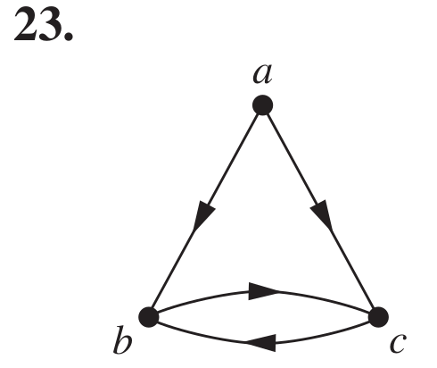
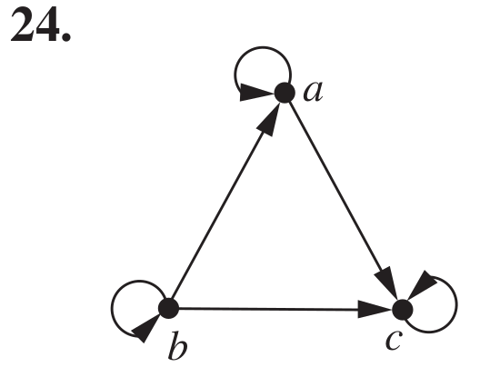
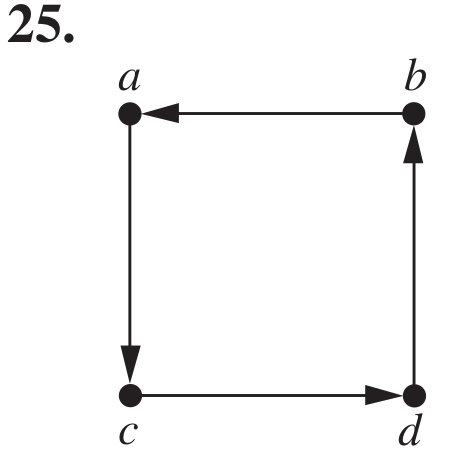
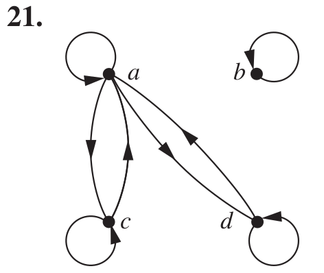

>Mathematical Logic and Graph Theory 2022 Homework 6 Answers
>
>By [Jingyi Chen](chenjingyi071@mail.ustc.edu.cn) with C and [Songxiao Guo](logname@mail.ustc.edu.cn) with G after each question number.

[TOC]

#### 5.3.15 C

> Let $R$ be the relation represented by the matrix
> $$
> \bold M_R=\left[
> \begin{matrix}
> 0&1&0\\
> 0&0&1\\
> 1&1&0
> \end{matrix}
> \right]
> $$
> Find the matrices that represent
> a) $R^ 2$ .
> b) $R^ 3$ .
> c) $R^ 4$ .

#### 5.3.31 C

>Determine whether the relations represented by the directed graphs shown in Exercises 23–25 are reflexive, irreflexive, symmetric, antisymmetric, and/or transitive.
>
>

#### 5.4.13 C

>Suppose that the relation $R$ on the finite set $A$ is represented by the matrix $\bold M_ R$ . Show that the matrix that represents the symmetric closure of $R$ is $\bold M _R ∨ \bold M^ t_R$ .

#### 5.4.23 C

>Suppose that the relation $R$ is symmetric. Show that $R^ ∗$is symmetric.

#### 5.4.29 C

>Find the smallest relation containing the relation $\{(1, 2), (1, 4), (3, 3), (4, 1)\}$ that is
>
>- a) reflexive and transitive.
>- b) symmetric and transitive.
>- c) reflexive, symmetric, and transitive.

#### 5.5.7 G

>Show that the relation of logical equivalence on the set of all compound propositions is an equivalence relation. What are the equivalence classes of $F$ and of $T$?

用 $R(p,q)$ 表示在复合命题集合里面有 $p\leftrightarrow q$。$p\leftrightarrow q$ 表示 $p$ 与 $q$ 有相同的真值。下面证明 $R$ 是一个等价关系：

- 自反性：$p$ 与 $p$ 显然有相同的真值。
- 对称性：如果 $p$ 与 $q$ 有相同的真值，则显然有 $p$ 与 $p$ 有相同的真值。
- 传递性：如果 $p$ 与 $q$ 有相同的真值，且 $q$ 与 $r$ 有相同的真值，显然有 $p$ 与 $r$ 有相同的真值。

$T$ 的等价类是所有永真式构成的集合；$F$ 的等价类是所有永假式构成的集合。

#### 5.5.21 G

>Determine whether the relation with the directed graph shown is an equivalence relation.
>
>

不是。该关系包括$(d,a),(a,c)$，但不包括 $(d,c)$，不满足传递性。

#### 5.5.47 G

>List the ordered pairs in the equivalence relations produced by these partitions of $\{0, 1, 2, 3, 4, 5\}$.
>
>- a) $\{0\}, \{1, 2\}, \{3, 4, 5\}$
>- b) $\{0, 1\}, \{2, 3\}, \{4, 5\}$
>- c) $\{0, 1, 2\}, \{3, 4, 5\}$
>- d) $\{0\}, \{1\}, \{2\}, \{3\}, \{4\}, \{5\}$

- a)
  $$
  (0,0),(1,1),(2,2),(1,2),(2,1),(3,3),(4,4),(5,5),(3,4),(4,3),(3,5),(5,3),(4,5),(5,4)
  $$

- b)
  $$
  (0,0),(1,1),(0,1),(1,0),(2,2),(3,3),(2,3),(3,2),(4,4),(5,5),(4,5),(5,4)
  $$

- c)
  $$
  (0,0),(1,1),(2,2),(1,2),(2,1),(0,2),(2,0),(0,1),(1,0),\\(3,3),(4,4),(5,5),(3,4),(4,3),(3,5),(5,3),(4,5),(5,4)
  $$

- d)
  $$
  (0,0),(1,1),(2,2),(3,3),(4,4),(5,5)
  $$

#### 5.5.59 G

>Let $R$ be the relation on the set of all colorings of the $2 × 2$ checkerboard where each of the four squares is colored either red or blue so that $(C_ 1 , C _2 )$, where $C_ 1$ and $C _2$ are $2 × 2$ checkerboards with each of their four squares colored blue or red, belongs to $R$ if and only if $C _2$ can be obtained from $C _1$ either by rotating the checkerboard or by rotating it and then reflecting it.
>
>- a) Show that $R$ is an equivalence relation.
>- b) What are the equivalence classes of $R$?

- a)

  - 自反性：$C$ 可以通过 $C$ 旋转 $360^\circ$ 得到。
  - 对称性：如果 $C_1$ 由 $C_2$ 旋转 $\theta$ 得到，则 $C_2$ 由 $C_1$ 旋转 $360^\circ-\theta$ 得到；如果 $C_1$ 由 $C_2$ 旋转 $\theta$，再翻转得到，则 $C_2$ 由 $C_1$ 旋转 $360^\circ-\theta$，再翻转得到。
  - 传递性：如果 $C_1$ 由 $C_2$ 旋转 $\theta_1$ 得到， $C_2$ 由 $C_3$ 旋转 $\theta_2$ 得到，则 $C_1$ 由 $C_3$ 旋转 $\theta_1+\theta_2$ 得到；如果 $C_1$ 由 $C_2$ 旋转 $\theta_1$ ，再翻转得到， $C_2$ 由 $C_3$ 旋转 $\theta_2$ 得到，则 $C_1$ 由 $C_3$ 旋转 $\theta_1+\theta_2$ ，再翻转得到；如果 $C_1$ 由 $C_2$ 旋转 $\theta_1$ 得到， $C_2$ 由 $C_3$ 旋转 $\theta_2$ ，再翻转得到，则 $C_1$ 由 $C_3$ 旋转 $\theta_1+\theta_2$ ，再翻转得到；如果 $C_1$ 由 $C_2$ 旋转 $\theta_1$ ，再翻转得到， $C_2$ 由 $C_3$ 旋转 $\theta_2$ ，再翻转得到，则 $C_1$ 由 $C_3$ 旋转 $\theta_1+\theta_2$ 得到。

- b)
  $$
  \{
  \left(
  \begin{matrix}
  r&r\\
  r&r
  \end{matrix}
  \right)
  \},
  \{
  \left(
  \begin{matrix}
  b&b\\
  b&b
  \end{matrix}
  \right)
  \},
  \{
  \left(
  \begin{matrix}
  r&r\\
  b&r
  \end{matrix}
  \right),
  \left(
  \begin{matrix}
  b&r\\
  r&r
  \end{matrix}
  \right),
  \left(
  \begin{matrix}
  r&b\\
  r&r
  \end{matrix}
  \right),
  \left(
  \begin{matrix}
  r&r\\
  r&b
  \end{matrix}
  \right)
  \},
  \{
  \left(
  \begin{matrix}
  b&b\\
  r&b
  \end{matrix}
  \right),
  \left(
  \begin{matrix}
  r&b\\
  b&b
  \end{matrix}
  \right),
  \left(
  \begin{matrix}
  b&r\\
  b&b
  \end{matrix}
  \right),
  \left(
  \begin{matrix}
  b&b\\
  b&r
  \end{matrix}
  \right)
  \},\\
  \{
  \left(
  \begin{matrix}
  b&b\\
  r&r
  \end{matrix}
  \right),
  \left(
  \begin{matrix}
  r&b\\
  r&b
  \end{matrix}
  \right),
  \left(
  \begin{matrix}
  r&r\\
  b&b
  \end{matrix}
  \right),
  \left(
  \begin{matrix}
  b&r\\
  b&r
  \end{matrix}
  \right)
  \},
  \{
  \left(
  \begin{matrix}
  r&b\\
  b&r
  \end{matrix}
  \right),
  \left(
  \begin{matrix}
  b&r\\
  r&b
  \end{matrix}
  \right)
  \}.
  $$

#### 5.5.63 G

>Do we necessarily get an equivalence relation when we form the transitive closure of the symmetric closure of the reflexive closure of a relation?

能。一个关系的自反闭包的对称闭包的传递闭包，显然具有自反性、对称性及传递性。

