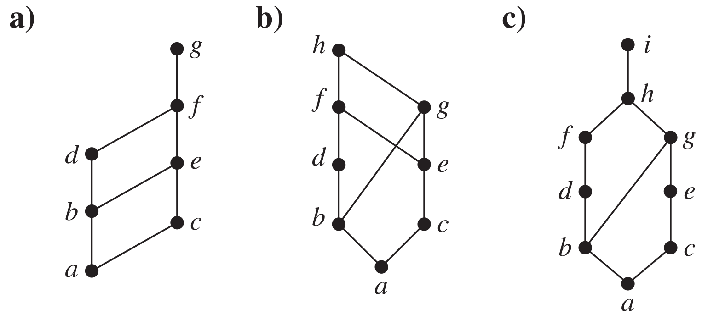
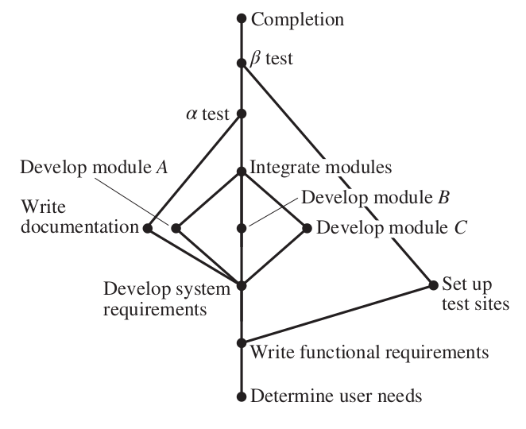
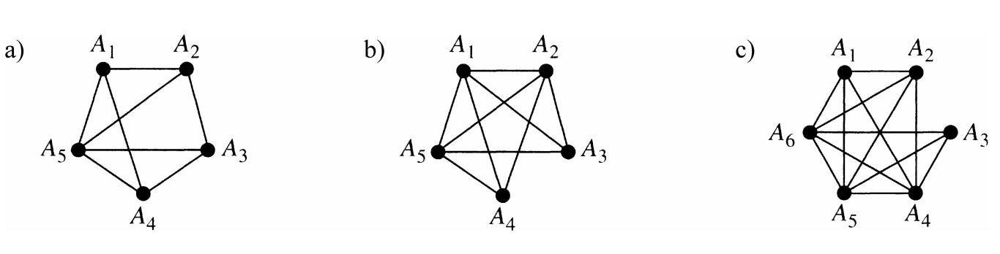
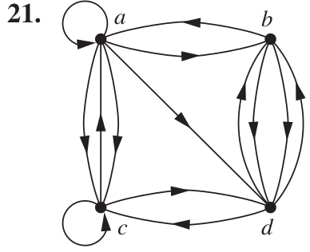
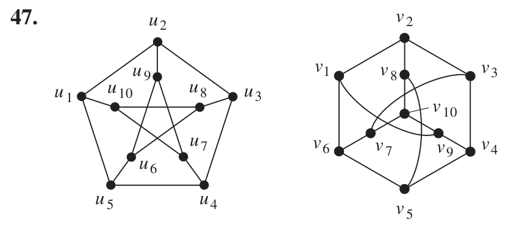

>Mathematical Logic and Graph Theory 2022 Homework 6 Answers
>
>By [Jingyi Chen](chenjingyi071@mail.ustc.edu.cn) with C and [Songxiao Guo](logname@mail.ustc.edu.cn) with G after each question number.

[TOC]

#### 5.6.3 G

>Is $(S, R)$ a poset if $S$ is the set of all people in the world and $(a, b) ∈ R$, where $a$ and $b$ are people, if
>
>- a) $a$ is taller than $b$?
>- b) $a$ is not taller than $b$?
>- c) $a = b$ or $a$ is an ancestor of $b$?
>- d) $a$ and $b$ have a common friend?

- a) 不是，没有自反性。
- b) 不是，没有反对称性。
- c) 是。
- d) 不是，没有传递性。

#### 5.6.33 G

>Answer these questions for the poset ($\{3, 5, 9, 15, 24, 45\}, ∣$).
>
>- a) Find the maximal elements.
>- b) Find the minimal elements.
>- c) Is there a greatest element?
>- d) Is there a least element?
>- e) Find all upper bounds of $\{3, 5\}$.
>- f ) Find the least upper bound of $\{3, 5\}$, if it exists.
>- g) Find all lower bounds of $\{15, 45\}$.
>- h) Find the greatest lower bound of $\{15, 45\}$, if it exists.

- a) $24$、$45$。
- b) $3$、$5$。
- c) 没有。
- d) 没有。
- e) $15$、$45$。
- f) $15$。
- g) $3$、$5$、$15$。
- h) $15$。

#### 5.6.43 G

>Determine whether the posets with these Hasse diagrams are lattices.
>
>

- a) 是。
- b) 不是，$\{b,e\}$ 没有最小上界。
- c) 是。

#### 5.6.49 G

>Show that the set of all partitions of a set $S$ with the relation $P _1\preccurlyeq P _2$ if the partition $P_ 1$ is a refinement of the partition $P_ 2$ is a lattice.

设 $\Pi$ 是集合 $S$ 的所有划分组成的集合。先证明 $(\Pi,\preccurlyeq)$ 是偏序集：

- 自反性：显然。
- 反对称性：对 $P_1,P_2\in\Pi$ ，假设 $P_1\preccurlyeq P_2$ 且 $P_2\preccurlyeq P_1$，取 $T\in P_1$，则 $\exist T'\in P_2$，有 $T\subseteq T'$。进一步 $\exist T''\in P_1$，有 $T'\subseteq T''$。$T\neq \empty$ 且 $T''\neq\empty$ 时，由于 $P_1$ 是划分，若 $T\neq T''$，则 $T\cap T''=\empty$，故有 $T= T''$。进一步，$T= T'$。由 $T$ 的任意性，以及 $P_1,P_2$ 是划分，有$P_1=P_2$。
- 传递性：假设 $P_1\preccurlyeq P_2$ 且 $P_2\preccurlyeq P_3$，取 $T\in P_1$，则 $\exist T'\in P_2$，有 $T\subseteq T'$。进一步 $\exist T''\in P_3$，有 $T'\subseteq T''$。故 $T\in T''$。由 $T$ 的任意性，以及 $P_1,P_3$ 是划分，有 $P_1 \preccurlyeq P_3$。

再证明对 $\forall (P_1,P_2)\in\Pi$ ，$P_1,P_2$ 都有最小上界和最大下界：

- 最小上界：$\forall (P_1,P_2)\in\Pi$，我们这样构造它们的上界 $P_3$：取 $P'=P_1\cup P_2$，对 $\forall T\in P'$ ，若 $\exist T'\in P_1\cup P_2\and T\cap T'\neq\empty$，则从 $P$ 中去掉 $T,T'$，然后用 $T\cup T'$代替它。（闭包）最终得到的 $P'$ 便是 $P_3$。任取 $P_1$ 和 $P_2$ 的上界 $P_4$，$\forall T_1\in P_1,\exist T_1'\in P_4;\forall T_2\in P_2,\exist T_2'\in P_4$。由于 $P_4$ 是划分，故只有 $T_1'=T_2'$ 或 $T_1'\cap T_2'=\empty$。由构造规则，若$T_1$ 的闭包与 $T_2’$ 相交，则在某一步中，$\exist T'\in P_1\cup P_2，T'\neq\empty$，有 $T'-T_1'-T_2'\neq\empty$，只能有 $T_1'=T_2'$，这样对 $T_1,T_1'$ 有 $T_1$ 的闭包属于 $T_1'$。另一方面，$T_1$ 的闭包是划分 $P_3$ 的元素，由 $T_1$ 的任意性，证明了 $P_3$ 是 $P_1$ 和 $P_2$ 的最小上界。
- 最大下界：$\forall (P_1,P_2)\in\Pi$，易知 $P_3=\{T|T= T_1\cap T_2,T_1\in P_1,T_2\in P_2\}$ 是$P_1$ 和 $P_2$ 的下界。任取 $P_1$ 和 $P_2$ 的下界 $P_4$ ，$\forall T\in P_4,\exist T_1\in P_1,\exist T_2\in P_2,T\in T_1\and T\in T_2\Rightarrow T\in T_1\cap T_2$，故 $T\in P_3$。由 $T$ 的任意性，以及 $P_4,P_3$ 是划分，有 $P_4 \preccurlyeq P_3$。这就证明了 $P_3$ 是 $P_1$ 和 $P_2$ 的最大下界。

#### 5.6.67 G

>Find an ordering of the tasks of a software project if the Hasse diagram for the tasks of the project is as shown.
>
>

确定用户需求 $\prec$ 写出功能需求 $\prec$ 设置测试点 $\prec$ 开发系统需求 $\prec$ 写文档 $\prec$ 开发模块 A $\prec$ 开发模块 B $\prec$ 开发模块 C $\prec$ 模块集成 $\prec$ $\alpha$ 测试 $\prec$ $\beta$ 测试 $\prec$ 完成。

#### 6.1.11 G

>Let $G$ be a simple graph. Show that the relation $R$ on the set of vertices of $G$ such that $uRv$ if and only if there is an edge associated to $\{u, v\}$ is a symmetric, irreflexive relation on $G$.

- 对称的：由简单图边的无向性，知 $uRv$ 则 $vRu$。
- 反自反的：由简单图无重边知 $u\not Ru$。

#### 6.1.13 G

>The intersection graph of a collection of sets $A_ 1 ,A_ 2 , \cdots , A_ n$ is the graph that has a vertex for each of these
>sets and has an edge connecting the vertices representing two sets if these sets have a nonempty intersection.
>Construct the intersection graph of these collections of sets.
>
>- a) $A_ 1 = \{0, 2, 4, 6, 8\}, A_ 2 = \{0, 1, 2, 3, 4\},A_ 3 = \{1, 3, 5, 7, 9\}, A _4 = \{5, 6, 7, 8, 9\},A_ 5 = \{0, 1, 8, 9\}$
>- b) $A_1= \{\cdots , −4, −3, −2, −1, 0\},A_2= \{\cdots , −2, −1, 0, 1, 2, \cdots\},\\A_3= \{\cdots , −6, −4, −2, 0, 2, 4, 6, \cdots\},A_4= \{\cdots , −5, −3, −1, 1, 3, 5, \cdots\},A_5= \{\cdots, −6, −3, 0, 3, 6, \cdots\}$
>- c) $A_ 1 = {x ∣ x < 0},
>  A _2 = {x ∣ −1 < x < 0},
>   A _3 = {x ∣ 0 < x < 1},
>   A _4 = {x ∣ −1 < x < 1},
>   A _5 = {x ∣ x > −1},
>   A _6 = R$

#### 6.1.29 G

>Describe a graph model that represents whether each person at a party knows the name of each other person at the party. Should the edges be directed or undirected? Should multiple edges be allowed? Should loops be allowed?

令 $V$ 是参加聚会的人的集合，$E$ 是 $V\times V$ 中满足 $u$ 知道 $v$ 的名字的有序对 $(u,v)$ 的集合。不允许多重边、有向图、允许环。

#### 6.2.5 G

>Can a simple graph exist with 15 vertices each of degree five?

不存在。总度数等于边数的二倍，为偶数，与 $15\times=75$ 为奇数矛盾。

#### 6.2.27 C

>Suppose that there are four employees in the computer support group of the School of Engineering of a large university. Each employee will be assigned to support one of four different areas: hardware, software, networking, and wireless. Suppose that Ping is qualified to support hardware, networking, and wireless; Quiggley is qualified to support software and networking; Ruiz is qualified to support networking and wireless, and Sitea is qualified to support hardware and software.
>
>- a) Use a bipartite graph to model the four employees and their qualifications.
>- b) Use Hall’s theorem to determine whether there is an assignment of employees to support areas so that each employee is assigned one area to support.
>- c) If an assignment of employees to support areas so that each employee is assigned to one support area exists, find one.

a)人是PQRS，工作是hsnw，则二分图是$\{\{P,h\},\{P,n\},\{P,w\}\{Q,s\},\{Q,n\},\{R,n\},\{R,w\},\{S,h\},\{S,s\}\}$；

b)存在，因为任抽几个人，相应能完成的工作都比人数多，所以定理条件成立。

c)答案不唯一，能成就行。

#### 6.2.33 C

>Suppose that m people are selected as prize winners in a lottery, where each winner can select two prizes from a collection of different prizes. Show if there are 2m prizes that every winner wants, then every winner is able to select two prizes that they want.

建议构造二分图，一边是每个获奖者被表示两次的集合$v_1$，每次表示意味着他拿了一件奖品，另一边是2m件奖品的集合$V_2$。对于$V_1$的任一子集A，$N(A)=V_2$，所以$|N(A)|\geq|A|$，所以Hall定理（霍尔婚配定理）成立了。

#### 6.2.47 C

>Show that a sequence $d_ 1 , d _2 , \cdots , d _n$ of nonnegative integers in nonincreasing order is a graphic sequence if and only if the sequence obtained by reordering the terms of the sequence $d_ 2 − 1, \cdots , d_{ d_ 1	 +1} − 1, d _{d _1} +2 , \cdots , d _n$ so that the terms are in nonincreasing order is a graphic sequence.

前推后：如果原本的序列是成图序列，那么去掉第一个点，并把与第一个点相连的点的度数减一形成的当然是成图序列；这时对于前$d_1$个点中没有被度数减一的点（说明它没和第一个点连着），它度数必比“不在前$d_1$个点但被度数减一的点”度数要大，说明至少有一个点与前者相连而与后者不相连，那就把前者的这个连边给后者即可，如此调整即得到第二个成图序列。

后推前：后一个序列是成图序列，则直接把前$d_1$个点连一个新加入的点，就得到前者的成图序列了。

#### 6.2.51 C

>How many subgraphs with at least one vertex does $K_ 3$ have?

17个。只有一个顶点：3个；有两个顶点：6个；有三个顶点：8个。

#### 6.2.63 C

>If the simple graph $G$ has $v$ vertices and $e$ edges, how many edges does $\overline G$ have?

$v(v-1)/2-e$。总的可能边数减去G的边数就是$\overline G$的边数。

#### 6.3.21 C

>Fnd the adjacency matrix of the given directed multigraph with respect to the vertices listed in alphabetic order.

$\left[
\begin{matrix}
1&1&2&1\\
1&0&0&2\\1&0&1&1\\0&2&1&0
\end{matrix}
\right]$

#### 6.3.33 C

>What is the sum of the entries in a column of the adjacency matrix for an undirected graph? For a directed graph?

前者是$deg(v)$减去v处的环数（自己和自己有环不算相邻），后者是$deg^-(v)$即入度。

#### 6.3.47 C

>Determine whether the given pair of graphs is isomorphic. Exhibit an isomorphism or provide a rigorous argument that none exists.

是同构的。证明图的同构可以构造出相同的邻接矩阵，例如此题将左侧的点1~10映射到右侧的1,9,4,5,6,7,8,3,10,2（答案不唯一）。

#### 6.3.49 C

>Show that isomorphism of simple graphs is an equivalence relation.

自己肯定和自己同构，所以是自反的。G和H同构则存在点的一一映射关系保持了相邻和不相邻性，这个一一映射反过来也对，所以是对称的。G和H同构，则有一一映射f，H和G同构，则有一一映射g，那么$g\circ f$也是一一映射并保证了相邻和非相邻性的，所以是传递的。

#### 6.3.59 C

>How many nonisomorphic simple graphs are there with five vertices and three edges?

4个。为了确保不同构，可以把度数按降序排列，4种情况分别是31110,21111,22110,22200。